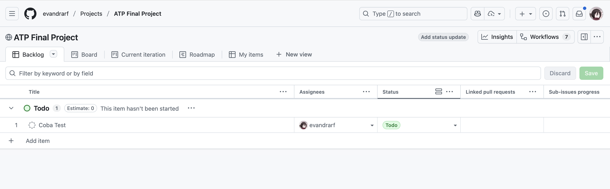
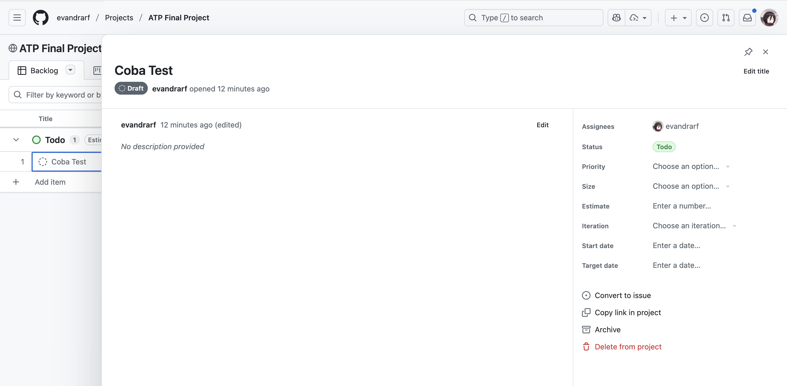
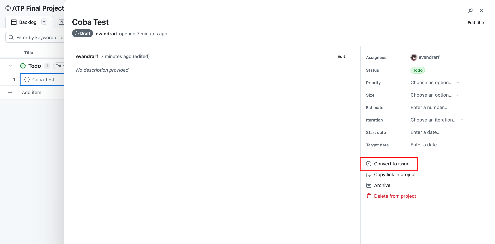
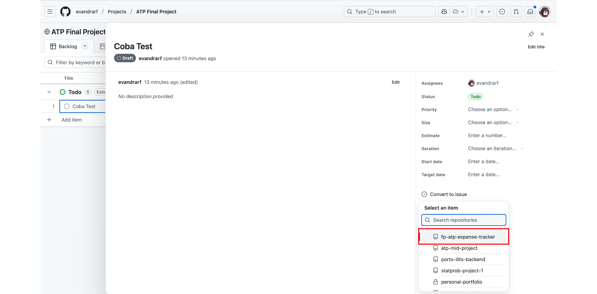
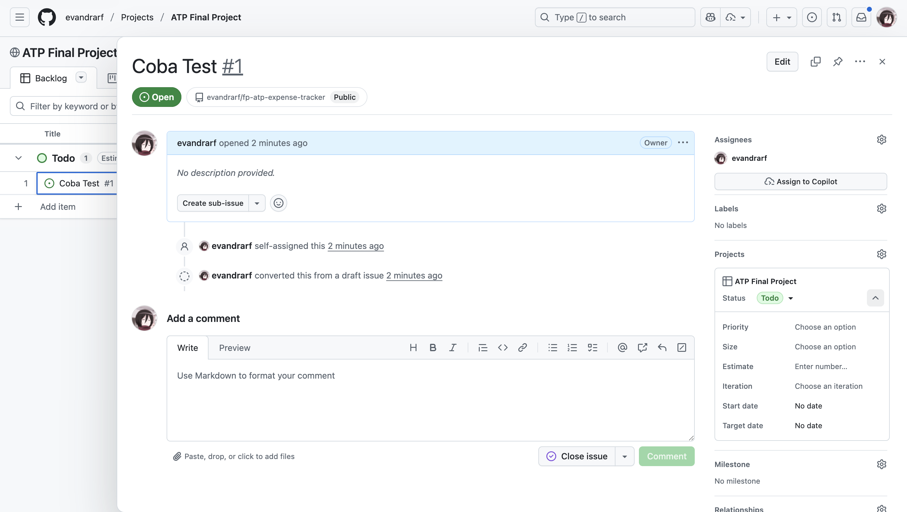
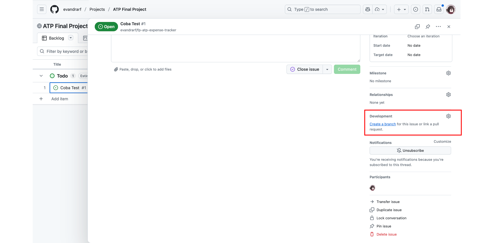
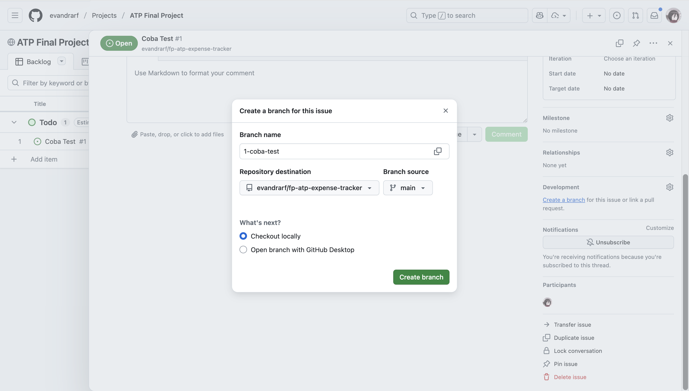
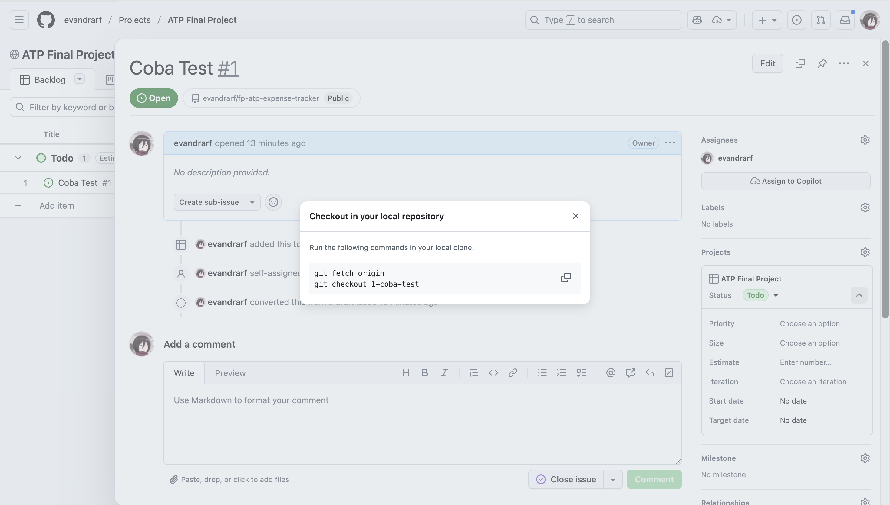

# 🎓 ATP Final Project

## Expense Tracker

### 👥 Class A — Team 2

- **Evandra Raditya Fauzan (5027251001)**
- **Muhammad Satrio Utomo (5027251022)**
- **Albert Chen (5027251034)**
- **Sebastian Elro (5027251040)**

---

### 📁 Project Structure

- **src/main.cpp** — The entry point of the program. All main logic and code implementation are written here.
- This repository contains one protected branch: **`main`**.  
  Direct `git push` to the main branch is **not allowed** to prevent conflicts when multiple members edit the same code.

---

### 🧭 How to Work with the Code

#### 1. Clone the Repository

Make sure **Git** is installed on your machine.

```bash
git clone https://github.com/evandrarf/atp-mid-project.git
```

#### 2. Start From Your Assigned Task in GitHub Projects

- Go to the Projects tab of the repository.



- Find the task that has been assigned to you.



- Open the task and select Convert to Issue (if it’s not an issue yet).



- Choose the correct repository when creating the issue



This ensures the task is tracked properly through the project board.

#### 3. Create a Branch From the Issue

This is how a task that has been converted to an issue will look like



Once the issue exists, you can create a branch directly linked to it:

- On the Issue page, click Create a branch



- Click the **`Create branch`** button, please ensure if repository is correct and branch source is main



- Run the following code in project folder



#### 4. Edit the Code

Open and edit the `main.cpp` file to add or modify your part of the program.

#### 5. Commit and Push Your Changes

After editing, commit your changes and push them to your branch, not to the main branch.

```bash
git add .
git commit -m "Add feature XYZ"
git push origin your-branch-name
```

#### 6. Create a Pull Request

When your code is ready, create a Pull Request (PR) from your branch into the main branch on GitHub.
Your teammates will review the code before it’s merged to ensure everything works correctly and maintains consistency.

### ✅ Notes

Always pull the latest updates from the main branch before starting work to avoid conflicts:

```bash
git pull origin main
```

Keep your commits clear and descriptive.

Communicate with your teammates when editing shared parts of the code.
